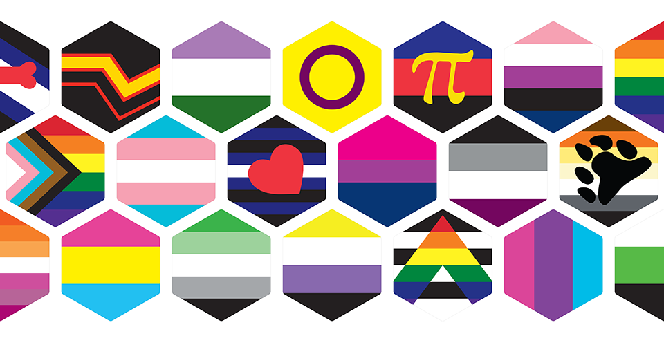

# LGBTQ+ Hexagon Pride Flag Stickers

This repository contains a collection of over 30 hexagonal stickers representing various LGBTQ+ Pride flags.

The hexagons have the following characteristics:

- designed for Sticker Mule&rsquo;s [2.17&rdquo; &times; 2.5&rdquo; hexagon sticker template](https://www.stickermule.com/uses/hexagon-stickers)
- no visible graphic content outside the cut line
- a white border that extends &frac18;&rdquo; inside the cut line
- a 1 point grey line around the inside of the white boarder

Image assets from the [lgbtq-flag-stickers](https://github.com/brokenarc/lgbtq-flag-stickers) repository were used to create these stickers.

## Asset Files

### Adobe Illustrator source files

The Illustrator files have been assembled for printing as stickers. Each file has the following characteristics:

- CMYK color space
- artboards measure 2&frac34;&rdquo; (69.85 mm) square
- minimum &frac18;&rdquo; (3.176 mm) gap between artboard edge and hexagon points
- stripes and bars on flag graphics overlap (reduces export artifacts)

### Screen image files

Screen display versions are provided in scalable (SVG) and bitmap (PNG) formats. The PNG files are 1,024 pixels high and have transparent backgrounds.

### Template

The blank template used to create the hexagons is located at the top level of the project as the file `hexagon-sticker-2_5-inch.ait`. A cut line path is provided on its own layer to support making stickers with no inside border.

## Downloading

Click on the green button labeled &ldquo;Code&rdquo; above. A popup menu will appear. Click the &ldquo;Download ZIP&rdquo; item at the bottom of that menu. A .zip file containing a copy of this repository and all the images will then be downloaded.

The images may also be downloaded individually by browsing to the desired flag folder and downloading the format you prefer.

## Design liberties

Some flag designs required changes in order them to fit visually within a hexagonal shape. Those changes are outlined below.

- `hex-autistic` - reduced size of infinity symbol
- `hex-bear` - increased size of bear paw and moved to central position
- `hex-infinity-pride-rainbow` - reduced size of infinity symbol
- `hex-infinity-transgender` - reduced size of infinity symbol
- `hex-leather` - increased size of heart and moved to central position
- `hex-polyamorous` - increased size of pi symbol
- `hex-polyamorous-infinity-heart` - decreased size of infinity heart symbol
- `hex-pony` - reduced size of circle and horseshoes
- `hex-pride-new` - turned QTPOC stripes vertical and reduced stripe with slightly.
- `hex-rubber` - adjusted vertical offset of stripes
- `hex-twink` - increased size of male symbols

## Designer credits

See the [Designer credits](https://github.com/brokenarc/lgbtq-flag-stickers#designer-credits) section of the [lgbtq-flag-stickers](https://github.com/brokenarc/lgbtq-flag-stickers) repository for information about the flag designers.

## License

These graphic assets are licensed under the
[Creative Commons Attribution-ShareAlike 4.0 International](./LICENSE "license text")
license. The graphic designs themselves are owned by their original creators
and may have restrictions on commercial use.
